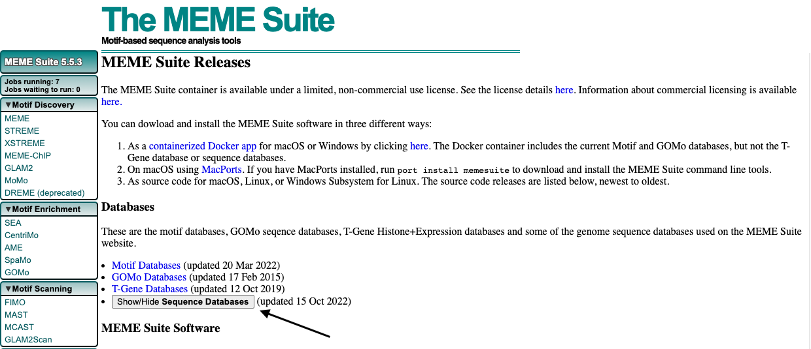
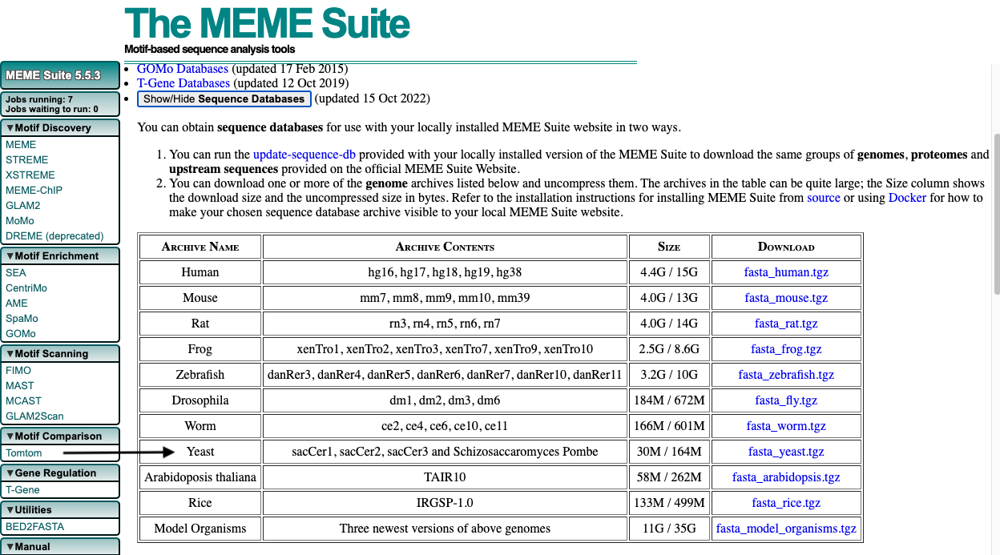
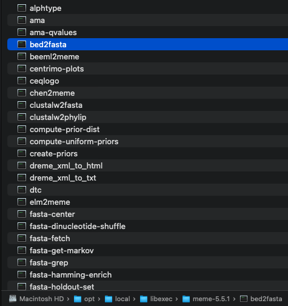

# ChEC-seq_Peak_Finder
## Introduction
ChIP-seq (chromatin immunoprecipitation followed by sequencing) is commonly used to identify genome-wide protein-DNA interactions. However, ChIP-seq often gives a low yield, which is not ideal for quantitative outcomes. An alternative method to ChIP-seq is ChEC-seq (Chromatin endogenous cleavage with high-throughput sequencing). In this method, the endogenous TF (transcription factor) of interest is fused with MNase (micrococcal nuclease) that non-specifically cleaves DNA near binding sites. Compared to the [original ChEC-seq method](https://www.nature.com/articles/ncomms9733), the [modified version](https://sites.northwestern.edu/bricknerlab/) requires far less amplification. Since [MACS3](https://github.com/macs3-project/MACS/tree/master#introduction) failed to identify peaks in data generated from the modified ChEC-seq method, a new peak finder has been developed specifically for it.

There are three functions in the *`peak_finder/`*. `callpeaks()` is used to identify peaks from BAM files. `goanalysis()` is used to make GO (Gene Ontology) term plots from peaks. `bedtomeme()` is a wrapper function to perform [MEME analysis](https://meme-suite.org/meme/tools/meme) in R **after [MEME Suite](https://meme-suite.org/meme/doc/download.html) is installed locally**.  
## Usage
1. Clone the ChEC-seq_Peak_Finder Repo
```
git clone https://github.com/ChengzheDuan/ChEC-seq_Peak_Finder.git
```
2. Navigate to the *`peak_finder/`* folder and open the *`run program.R`* file.
3. Set the working directory to where all the files are located
4. Load the `callpeaks()` function with:
```
source("peak finder.R")
```
5. Before running the peak finder with your own BAM files, run:
```
callpeaks(folder_treatment = "files_treatment_rap1",
          folder_control = "files_control_rap1",
          outdir = "test_folder"
)
```
This will verify if the peak finder runs correctly.

6. Once the function completes execution without any errors, load the `goanalysis()` function with:
```
source("GO analysis.R")
```
and run:
```
goanalysis(bedfile = "./test_folder/peaks.bed",
           outdir = "test_folder"
           )
```
to check if a GO term plot is generated.

7. Lastly, load the `bedtomeme()` wrapper function with:
```
source("run meme.R")
```
and run:
```
bedtomeme(bed2fasta_filepath = "/opt/local/libexec/meme-5.5.1/bed2fasta",
          fasta_output_filename = "test_folder/fasta4meme.fna",
          genome_file = "sacCer3.fna",
          bed_filepath = "test_folder/peaks.bed",
          meme_filepath = "/opt/local/bin/meme",
          meme_output_folder = "test_folder/meme_output")
```
to check if MEME results are generated. **Since `bedtomeme()` is a wrapper function, you must have the MEME Suite installed locally prior to using it. See the bedtomeme section below for more details**

## `callpeaks()`
Use `callpeaks()` to identify peaks from BAM files. Three output files are generated from the function. First, all the parameter values used to run the algorithm and the number of peaks after each filtering step are documented in a text file. Second, all the peaks identified by the algorithm are stored in a bed file. An Excel file is also created, which includes positions of local maxima, peaks retained after DESeq2, and doublet peaks. If the position of a peak falls within 700bp upstream of a gene, the peak is also annotated with that gene information.

### Required arguments

### `folder_treatment`:
Specify the folder where the treatment (TF-MNase) BAM files are located. The folder should be placed in the same location as all the scripts.

### `folder_control`:
Specify the folder where the control (sMNase) BAM files are located. The folder should be placed in the same location as all the scripts.

### Optional arguments

### `numcores`
Specify the number of CPU cores to use in the `mclapply()` function. See [`mclapply()`](https://www.rdocumentation.org/packages/parallel/versions/3.4.0/topics/mclapply) documentation for more details. **If Windows OS is detected, only 1 CPU core will be used.**

### `outdir`
Specify the name of the output folder. The folder will be created, and the peak finder results will be saved within it.

### `w`
Specify the sliding window size. See [`Slidingwindow()`](https://rdrr.io/github/coleoguy/evobir/man/SlidingWindow.html) documentation for more details.

### `stepsize`
Specify the step between windows. See [`Slidingwindow()`](https://rdrr.io/github/coleoguy/evobir/man/SlidingWindow.html) documentation for more details.

### `foldchange`
Specify the log foldchange value, which is the same as the lfcThreshold argument in DESeq2. See [DESeq2](https://bioconductor.org/packages/release/bioc/vignettes/DESeq2/inst/doc/DESeq2.html) for more details.

### `p_value`
Specify the adjusted p-value, which is used to filter DESeq2 results. See [DESeq2](https://bioconductor.org/packages/release/bioc/vignettes/DESeq2/inst/doc/DESeq2.html) for more details.

### `lower_distance`
Specify the distance below which doublet peaks closer than the set number will be filtered out.

### `upper_distance`
Specify the distance above which doublet peaks closer than the set number will be filtered out.

### `localmax_output`
If this argument is set as TRUE, a BED file with all identified local maxima will be generated

### `peaks_after_solmnase_filter`
If this argument is set as TRUE, a BED file with all the peaks survived sMNase filtering will be generated

## `goanalysis()`
Use `goanalysis()` to generate a GO term plot using a BED file.

### Required arguments

### `bedfile`
Specify both the location and the name of the BED file.

### `outdir`
Specify the name of the folder in which the GO term plot will be saved.

### Optional arguments

### `fontsize`
Specify the font size of each GO term.

### `termlength`
Specify the number of terms that will appear on the GO term plot.

## `bedtomeme()`
Use `bedtomeme()` to perform MEME analysis in R.

Since `bedtomeme()` is a wrapper function, please follow the steps below to download and install the MEME Suite first prior to using it:
1. Download the [MEME Suite](https://meme-suite.org/meme/doc/download.html).
2. Install the MEME Suite by following the [instructions](https://meme-suite.org/meme/doc/install.html?man_type=web). Installation using MacPorts is recommended.
3. Download the [yeast genome](https://meme-suite.org/meme/doc/download.html).
   1. Click "Show/Hide Sequence Databases"

      
      
   2. Click "fasta_yeast.tgz"
      
      
   3. Unzip "fasta_yeast.tgz"

   4. navigate to the *`fasta_yeast/UCSCOther/`* folder, copy *`sacCer3.fna`*, *`sacCer3.fna.bfile`*, and *`sacCer3.fna.fai`*, then paste them into the location where the peak finder scripts are located.

### Required arguments 

### `bed2fasta_filepath`
Specify the path to the `bed2fasta` program. **This file is usually hidden. Mac users can press `shift + command + .` to find it.**

For example:



### `fasta_output_filename`
Specify the file path and the name of the FASTA file converted from the BED file.

### `genome_file`
Specify the yeast genome file (It's usually sacCer3.fna).

### `bed_filepath`
Specify the file path and the name of the BED file.

### `meme_filepath`
Specify the path to the `meme` program. **This file is usually hidden. Mac users can press `shift + command + .` to find it.**

### `meme_output_folder`
Specify the name and the file path where the MEME results are saved.

### Optional argument 

### `meme_additional`
Specify any [additional arguments](https://meme-suite.org/meme/doc/meme.html) you'd like to use with the MEME program. 

For example:
```
bedtomeme(bed2fasta_filepath = "/opt/local/libexec/meme-5.5.1/bed2fasta",
          fasta_output_filename = "test_folder/fasta4meme.fna",
          genome_file = "sacCer3.fna",
          bed_filepath = "test_folder/peaks.bed",
          meme_filepath = "/opt/local/bin/meme",
          meme_additional = "-markov_order 2 -nmotifs 4",
          meme_output_folder = "test_folder/meme_output")
```

## Questions?
If you have any questions, please contact Dr. Jason Brickner (j-brickner@northwestern.edu)
